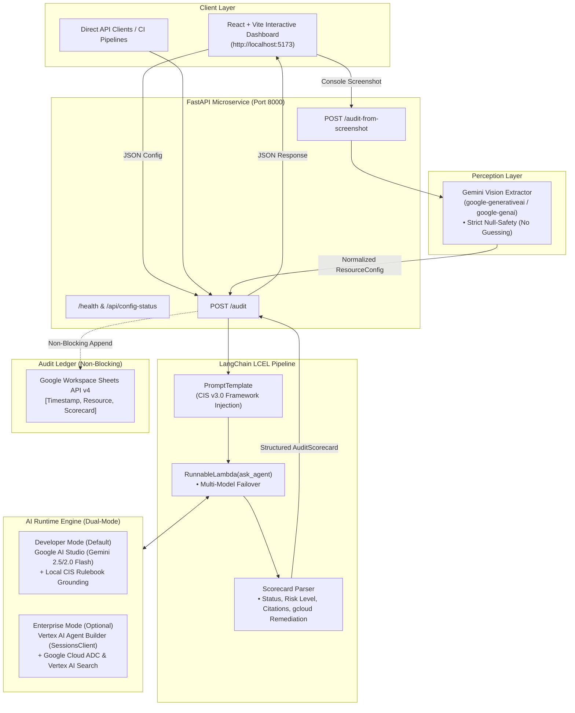

# CloudGuard AI — Automated Cloud Security & Compliance Audit Engine

[](https://www.python.org/)
[](https://fastapi.tiangolo.com/)
[](https://react.dev/)
[](https://python.langchain.com/)
[]()
[]()

**CloudGuard AI** is a cloud security and governance microservice that evaluates Google Cloud Platform (GCP) configurations against enterprise compliance baselines—grounded in the **CIS Google Cloud Foundations Benchmark v3.0**.

It bridges developer workflows and security operations by combining **LangChain Expression Language (LCEL)**, **Gemini Multimodal Vision**, **Google Workspace Sheets API v4**, and **Vertex AI / Google GenAI** integration.

---

## 🏛️ System Architecture



---

## 🔍 Core Architectural Decisions & Honest Boundaries

### 1. Multi-Framework RAG Engine (ChromaDB + Gemini Embeddings)
To ensure compliance audits are backed by authoritative regulatory standards, CloudGuard AI implements a dedicated **vector-retrieval engine**:
* **ChromaDB Multi-Collection Architecture**:
  - Automatically indexes regulatory benchmarks into local persistent vector collections under `backend/.chroma_db/`:
    - **`cis_gcp_benchmark`**: CIS Google Cloud Platform Foundation Benchmarks (`cis_gcp_benchmark_v3.0.txt` and `GCP_CIS_Foundation_Benchmark_v1.2.0.pdf`).
    - **`nist_sp_800_53`**: NIST SP 800-53 Rev. 5 Security & Privacy Controls (`NIST.SP.800-53r5.pdf`).
    - **`hipaa_part_164`**: HIPAA Security & Privacy Rule 45 CFR Part 164 (`45 CFR Part 164 (up to date as of 9-15-2026).pdf`).
  - **Dynamic Framework Routing**: Audits submitted with a specific compliance framework (e.g. HIPAA, NIST SP 800-53, or CIS GCP) automatically route vector similarity search to the matching collection.
  - **Dynamic Citations**: Citations in the audit scorecard are strictly derived from retrieved rule chunks—zero fabricated or hardcoded citations.
  - **High-Efficiency Batch Embeddings**: Uses Google's `gemini-embedding-001` (3072 dimensions) with built-in 429 quota backoff retry and local disk caching so embeddings are generated once and queried with sub-second latency.
* **Dual-Mode AI Runtime**:
  - **Standalone / Developer Mode (Default)**: Connects via `GEMINI_API_KEY` using Gemini 2.5 Flash with local ChromaDB RAG.
  - **Enterprise Vertex AI Mode (Optional)**: Connects via `VERTEX_AGENT_ID` using Google Cloud Dialogflow CX / Vertex AI Agent Builder.

### 2. Why LangChain LCEL Sits Between FastAPI and the LLM
* **Decoupling Protocol from Routing**: FastAPI handlers only manage HTTP validation, CORS, and response serialization. LangChain LCEL isolates prompt composition, variable formatting, and parsing.
* **Standardized Runnable Composition**:
  $$\text{PromptTemplate} \longrightarrow \text{RunnableLambda(Agent Invocation)} \longrightarrow \text{OutputParser}$$
* **Extensibility**: Makes it straightforward to chain additional security checks (e.g., CVE lookups, IAM policy analyzers) without changing API contracts.

### 3. Multimodal Console Vision with Strict Null-Safety
* DevOps teams often lack raw Terraform or JSON configs and only have a screenshot of a GCP Console page.
* Gemini Vision extracts visible settings (e.g., `public_access_prevention`, `uniform_bucket_level_access`, `encryption_type`).
* **Critical Guardrail**: The vision prompt strictly forbids inferring or guessing cloud defaults—unseen settings are explicitly set to `null`.
* **Zero Duplication**: Extracted configs flow through the *exact same* LangChain audit pipeline used by direct API submissions.

### 4. Non-Blocking Governance Logging
* Audits can be recorded into a central Google Spreadsheet via Google Sheets API v4.
* **Resilience**: The write operation is wrapped in a non-blocking exception handler. If credentials expire or a network error occurs, the API client still receives their complete compliance scorecard, while logging an operational warning.

### 5. Scoped Boundary (What It Does NOT Do)
* CloudGuard AI evaluates **configurations** (JSON or screenshots). It deliberately does **not** perform live port scans or call Security Command Center (SCC) asset crawler APIs to scan running infrastructure. This avoids requiring elevated admin IAM keys across customer production networks.

---

## 📁 Project Structure

```text
cloudguardai/
├── backend/
│   ├── app/
│   │   ├── __init__.py
│   │   ├── config.py                 # Pydantic Settings (.env configuration)
│   │   ├── models.py                 # Pydantic data contracts (ResourceConfig, AuditScorecard)
│   │   ├── rag_retriever.py          # Multi-framework ChromaDB vector retriever & PDF chunker
│   │   ├── vertex_agent_client.py    # Dual-mode engine (Gemini Flash RAG & Vertex Agent Builder)
│   │   ├── langchain_orchestrator.py # LangChain PromptTemplate & RunnableLambda LCEL pipeline
│   │   ├── workspace_writer.py       # Google Sheets API v4 audit logger (OAuth 2.0)
│   │   ├── vision_extractor.py       # Gemini Vision screenshot parser
│   │   └── main.py                   # FastAPI REST API endpoints
│   ├── tests/
│   │   ├── __init__.py
│   │   ├── test_client.py            # Task 1 unit tests (LangChain, /audit, error handling)
│   │   ├── test_rag_retriever.py     # Multi-framework RAG discrimination & citation tests
│   │   ├── test_workspace.py         # Task 2 unit tests (Google Sheets logging)
│   │   └── test_vision.py            # Task 3 unit tests (Gemini Vision extraction)
│   ├── requirements.txt
│   ├── .env.example
│   └── .gitignore
├── frontend/                         # Interactive Compliance Dashboard
│   ├── src/
│   │   ├── App.jsx                   # Main React dashboard (Presets, Audit, Multimodal upload)
│   │   ├── index.css                 # Clean, responsive CSS styling
│   │   └── main.jsx
│   ├── package.json
│   └── vite.config.js
├── compliance_rulebooks/
│   ├── cis_gcp_benchmark_v3.0.txt    # CIS GCP Benchmark v3.0 text rulebook
│   ├── GCP_CIS_Foundation_Benchmark_v1.2.0.pdf # CIS GCP Benchmark v1.2.0 PDF
│   ├── NIST.SP.800-53r5.pdf          # NIST SP 800-53 Rev. 5 Controls PDF
│   └── 45 CFR Part 164 (up to date as of 9-15-2026).pdf # HIPAA Security & Privacy Rule PDF
└── README.md
```

---

## 🚀 Quickstart & Local Setup

### Prerequisites
- Python 3.10+ (Python 3.12 recommended)
- Node.js 18+ and npm
- A free [Google AI Studio Gemini API Key](https://aistudio.google.com/)

---

### 1. Backend Setup

```powershell
# Navigate to backend directory
cd backend

# Create and activate Python virtual environment
python -m venv venv
.\venv\Scripts\activate       # Windows PowerShell
# source venv/bin/activate    # macOS / Linux

# Install dependencies
pip install -r requirements.txt

# Configure environment variables
copy .env.example .env

# Edit .env and insert your GEMINI_API_KEY:
# GEMINI_API_KEY=your_actual_gemini_api_key_here

# Run the automated test suite
pytest tests/ -v

# Start the FastAPI server
python -m uvicorn app.main:app --host 127.0.0.1 --port 8000 --reload
```

The backend is now live at:
- **API Base:** `http://127.0.0.1:8000`
- **Interactive Swagger Docs:** `http://127.0.0.1:8000/docs`

---

### 2. Frontend Setup

In a new terminal:

```powershell
# Navigate to frontend directory
cd frontend

# Install Node dependencies
npm install

# Start Vite dev server
npm run dev
```

Open your browser at **`http://localhost:5173`**.

---

### 3. Google Workspace Sheets Setup (Optional)
To log compliance audits into a live Google Sheet:
1. Enable the **Google Sheets API** in your Google Cloud project.
2. Create an **OAuth 2.0 Client ID (Desktop Application)** and download it as `credentials.json` into `backend/`.
3. Create a Google Sheet and set `GOOGLE_SHEET_ID=<YOUR_SHEET_ID>` in `backend/.env`.
4. The first audit will open a local browser OAuth consent tab; once granted, `token.json` is cached locally.

---

## 📡 API Endpoints

| Method | Endpoint | Description |
| :--- | :--- | :--- |
| `GET` | `/health` | Service readiness, version, and environment status |
| `GET` | `/api/config-status` | Inspects configured GCP keys and Google Workspace bindings |
| `POST` | `/audit` | Evaluates a `ResourceConfig` against CIS GCP Benchmark v3.0 |
| `POST` | `/audit-from-screenshot` | Multimodal upload: extracts settings via Gemini Vision and audits |

### Sample Audit Request Payload:
```json
{
  "compliance_framework": "CIS Google Cloud Foundations Benchmark v3.0",
  "resource_config": {
    "resource_type": "storage.googleapis.com/Bucket",
    "resource_name": "corp-finance-records-prod",
    "public_access_prevention": "unspecified",
    "uniform_bucket_level_access": false,
    "encryption_type": "GOOGLE_MANAGED",
    "versioning_enabled": false
  }
}
```

### Sample Audit Response:
```json
{
  "resource_name": "corp-finance-records-prod",
  "framework": "CIS Google Cloud Foundations Benchmark v3.0",
  "scorecard": {
    "status": "FAIL",
    "risk_level": "CRITICAL",
    "summary": "The corp-finance-records-prod bucket violates foundational security controls...",
    "violations": [
      {
        "rule_id": "CIS-GCP-5.2",
        "title": "Compliance Violation: CIS-GCP-5.2",
        "severity": "CRITICAL",
        "description": "Cloud Storage buckets must have Public Access Prevention set to 'enforced'.",
        "citation": "CIS Google Cloud Foundations Benchmark v3.0.0",
        "remediation": "gcloud storage buckets update gs://corp-finance-records-prod --public-access-prevention"
      }
    ],
    "citations": [
      "CIS Google Cloud Foundations Benchmark v3.0.0",
      "Google Cloud Security Best Practices Guide"
    ],
    "remediation_steps": [
      "gcloud storage buckets update gs://corp-finance-records-prod --public-access-prevention",
      "gcloud storage buckets update gs://corp-finance-records-prod --uniform-bucket-level-access"
    ]
  },
  "logged_to_sheet": false,
  "agent_mode": "live",
  "error": null
}
```

---

## 🧪 Automated Testing

The project includes **19 comprehensive unit and integration tests** built with `pytest`:

```powershell
pytest backend/tests/ -v
```

```text
backend/tests/test_client.py .........                                   [ 47%]
backend/tests/test_vision.py ......                                      [ 78%]
backend/tests/test_workspace.py ....                                     [100%]

======================= 19 passed, 2 warnings in 1.68s ========================
```

---

## 🎯 Technical Interview Talking Points

1. **"How did you ground your compliance evaluation to prevent LLM hallucinations?"**
   - We maintain a curated CIS Google Cloud Foundations Benchmark rulebook. The LangChain LCEL pipeline injects the standard's exact constraints (`bucket.publicAccessPrevention == 'enforced'`) into the prompt and requires strict citation metadata in the output.
2. **"Why use LangChain instead of just calling Gemini directly from FastAPI?"**
   - LangChain LCEL provides clean separation of concerns. The prompt assembly, variable validation, model invocation (`RunnableLambda`), and scorecard parsing are modular Runnables. It also allows adding pre-flight safety checks or multi-agent supervisor patterns without rewriting endpoint handlers.
3. **"How does the multimodal vision pipeline handle unreadable screenshot fields?"**
   - The vision extractor prompt explicitly enforces strict null-safety: any cloud setting not clearly legible in the image is mapped to `null`. The compliance engine treats `null` as 'unspecified' and evaluates accordingly, preventing hallucinated configurations.
4. **"How do you handle API capacity spikes?"**
   - The agent platform client implements an automatic candidate model fallback (`gemini-3.5-flash` ➔ `gemini-3.5-flash-lite` ➔ `gemini-3.6-flash`). If Google's free-tier returns a 503 high-demand spike or 429 quota throttle, the service transparently backs off and fails over without failing the user's request.

---

## 📄 License
This project is open-source and available under the [MIT License](LICENSE).
